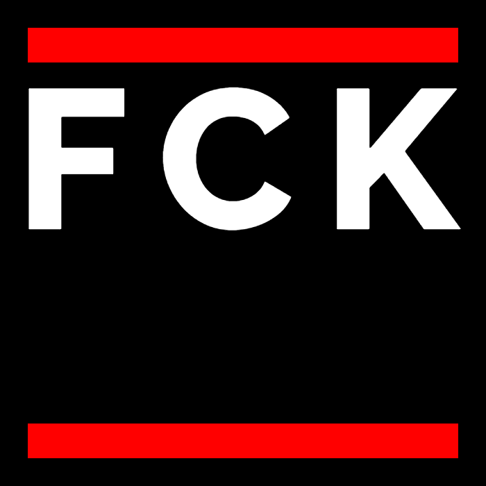

## FCK Generator | Restoration, Source & Recreation

This repository preserves **fck-generator.com**, the site that let users generate the iconic  sticker-style graphics.

The original domain disappeared, but a **version of it is still live via Firebase**, and the Firebase version includes the **original React source code**. This repo documents both the **recovered assets** and the **recreation**.

[VISIT THE ORIGINAL - "OFFICIAL" LIVE VERSION HERE](https://fck-generator.firebaseapp.com/)

---

## Contents
- **`/original-source/`** Original React source code recovered from archived JS  
- **`/original-compiled/`** A compiled version of the Original React Code
- **`/recreation-source/`** A cleaned-up version with  improvements (extra fonts, light/dark mode, removed sponsored items)  
- **`/recreation-compiled/`** A compiled version of my recreation

---

## How I Recovered the Original Assets

The Wayback Machine provided several snapshots of fck-generator.com. Following **[skeptric.com](https://skeptric.com/restoring-wayback-html/index.html)**, I recovered HTML, CSS, JS, and images.

### 1. Pulling Archived Files
- Extracted HTML, CSS, JS, and images from multiple snapshots  

### 2. Recovering Missing Fonts
- Original fonts were missing from archives  
- Found **Raleway** and **Outfit** on Google Fonts  

## But Then:

### Original React Source

While exploring archived JS from Wayback snapshots, I discovered a live **Firebase version**, which contains the **React source code**.  

This allows us to:
- Study the component structure  
- Understand the original logic  
- Build a compiled version ourself  

---

## Recreation Version

The `/recreation-source/` and `/recreation-compiled` versions are a cleaned-up take on the original:

- Removed sponsored items  
- Added several new fonts  
- Added **light/dark mode**  
- Cleaned layout and simplified code  
- Preserves original behavior
- **REMOVE TELEMETRY** Original Version Logged your IP and the text you entered, as well as various data such as your ISP info, usage rate, and more. yikes.  

---

## How to Host It Yourself

### Static Versions (`original-compiled` or `recreation-compiled`)
1. GitHub Pages, Netlify, or any web server  
2. Drop the folder contents into the hosting directory  
3. Works immediately (pure HTML/CSS/JS)  

### React/Source Versions (`original-source` or `recreation-source`)
1. Clone the folder  
2. Run `npm install`  
3. Run `npm start` to preview locally  
4. Optionally build with `npm run build` for production  

---

## Project Goals
- Preserve the original fck-generator.com  
- Provide access to the original React source code  
- Offer a cleaned-up recreation with light/dark mode and extra fonts  

---

## License
Recovered content comes from public archives and manual reconstruction.  
Recreation assets are free to use. React source is preserved for educational purposes.
